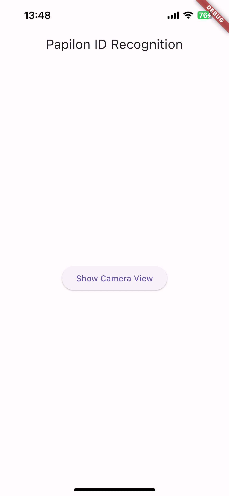
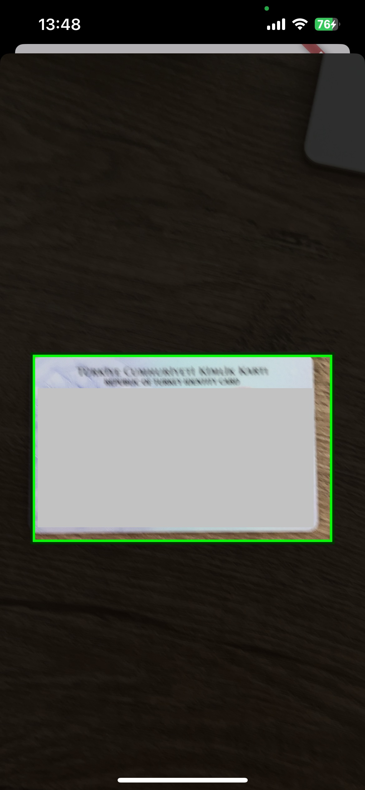

# PapilonIDRecognition-FlutterDemo
This is a Flutter implementation demo of the ID Recognition SDK.

### Prerequisites
- iOS 14+

## Installation
### 1. Podfile Configuration

Once you've created your Flutter project, navigate to your iOS directory and create your Podfile with the following:

```ruby
# Uncomment the next line to define a global platform for your project
platform :ios, '14.0'

target 'Runner' do
  # Comment the next line if you don't want to use dynamic frameworks
  use_frameworks!
  pod 'PapilonIDRecognitioniOS-SDK'

  # Pods for Runner

  target 'RunnerTests' do
    inherit! :search_paths
    # Pods for testing
  end
end
```
Then run:

```ruby
pod install
```

This will install the PapilonIDRecognitioniOS-SDK for your project.

### 2. Camera Permission

Ensure that your application has permission to access the camera. Update your info.plist accordingly.

    <!-- Camera Usage Description -->
    <key>NSCameraUsageDescription</key>
    <string>This app requires camera access to perform id recognition.</string>

### 3. Integrating SDK Components into iOS Application
### File 1: AppDelegate.swift
The AppDelegate.swift file manages the application's lifecycle and initializes necessary components for using the SDK.

Initialization: In your AppDelegate.swift file, import the necessary modules and ensure that the AppDelegate class conforms to the CameraManagerDelegate protocol.

Method Channel Handling: Implement method channel handling to communicate between Flutter and native code. The method channel named "com.yourcompany.papilonidrecognition/channel" is used for this purpose.

Camera View Presentation: Define the showCameraViewController() method to present the camera view controller (CameraViewController). This method sets up the camera manager and configures it with required parameters such as ID type, token, and license ID.

Camera Manager Delegate: Implement the CameraManagerDelegate methods as required by your application. These methods handle events related to camera capture and ID document detection.

### Example AppDelegate.swift File

```swift
import UIKit
import Flutter
import PapilonIDRecognitioniOS

@UIApplicationMain
@objc class AppDelegate: FlutterAppDelegate, CameraManagerDelegate {    
    // MARK: Properties
    private var cameraManager: CameraManager?
    private var flutterResult: FlutterResult?
    
    override func application(
        _ application: UIApplication,
        didFinishLaunchingWithOptions launchOptions: [UIApplication.LaunchOptionsKey: Any]?
    ) -> Bool {
        GeneratedPluginRegistrant.register(with: self)
        let controller = window?.rootViewController as! FlutterViewController
        let channel = FlutterMethodChannel(
            name: "com.yourcompany.papilonidrecognition/channel",
            binaryMessenger: controller.binaryMessenger)
        
        // MARK: Method Channel Handling
        channel.setMethodCallHandler({
            [weak self] (call: FlutterMethodCall, result: @escaping FlutterResult) in
            self?.flutterResult = result
            if call.method == "showCameraView" {
                self?.showCameraViewController()
            }
        })
        
        return super.application(application, didFinishLaunchingWithOptions: launchOptions)
    }
    
    // MARK: Methods
    private func showCameraViewController() {
        if let rootViewController = window?.rootViewController {
            let cameraViewController = CameraViewController()
            rootViewController.present(cameraViewController, animated: true, completion: {
                self.cameraManager = CameraManager()
                self.cameraManager?.delegateCameraManager = self
                self.cameraManager?.configureCameraManager(
                    idType: "<id_type>", // for example 792_id_front for Turkish ID Card
                    token: "<your_token>", 
                    licenseID: "<license_id>", 
                    in: cameraViewController.previewView
                    )
            })
        } else {
            flutterResult?(FlutterError(
                code: "UNAVAILABLE",
                message: "Root view controller is not available.",
                details: nil))
        }
    }
    
    
    // MARK: CameraManagerDelegate Methods
    func didDetectIDDocument(results: [String: Any]) {
        flutterResult?(results)
        print(results)
    }

        func didEvaluateDistance(evaluation: PapilonIDRecognitioniOS.IDRecognizer.DistanceEvaluation) {
        
    }
    
    func didUpdateMarkerImage(_ image: UIImage) {
        
    }
    
    func didCaptureImages(_ images: [PapilonIDRecognitioniOS.IDRecognizer.ImageResult]) {
        
    }
}
```

### File 2: CameraViewController.swift
The CameraViewController.swift file contains the implementation of the camera view controller.

Initialization: This file defines the CameraViewController class, which inherits from UIViewController. The viewDidLoad() method is called upon the view controller's initialization.

Preview View Setup: The setupPreviewView() method configures the preview view (previewView) where the camera feed will be displayed. This view is added as a subview to the view controller's main view.

Additional Configuration: Any additional camera configuration codes specific to your application can be added within the viewDidLoad() method.

### Example CameraViewController.swift File
```swift
import UIKit
import AVFoundation

class CameraViewController: UIViewController {
    var previewView: UIView!

    override func viewDidLoad() {
        super.viewDidLoad()
        setupPreviewView()
        // Other camera configuration codes will be here
    }

    func setupPreviewView() {
        previewView = UIView(frame: self.view.bounds)
        self.view.addSubview(previewView)
        // Configure `previewView` to display the camera feed
    }
}
```

### 4. Flutter Side Implementation
Implementation Details:

Platform Channel Setup: This Flutter code establishes communication with the native iOS code using the MethodChannel named 'com.yourcompany.papilonidrecognition/channel'.

Camera View Invocation: The _showCameraView() method is invoked when the "Show Camera View" button is pressed. This method sends a message to the native iOS side to display the camera view for ID recognition.

Handling Results: Upon receiving results from the native side, the Flutter application can handle them accordingly. In this example, the results are printed to the console for debugging purposes.


### Example main.dart File
```dart
import 'package:flutter/material.dart';
import 'package:flutter/services.dart';

void main() {
  runApp(MyApp());
}

class MyApp extends StatelessWidget {
  @override
  Widget build(BuildContext context) {
    return MaterialApp(
      home: MyHomePage(),
    );
  }
}

class MyHomePage extends StatefulWidget {
  @override
  _MyHomePageState createState() => _MyHomePageState();
}

class _MyHomePageState extends State<MyHomePage> {
  static const platform = MethodChannel('com.yourcompany.papilonidrecognition/channel');

  Future<void> _showCameraView() async {
    try {
      final dynamic result = await platform.invokeMethod('showCameraView');
      print('ID Document Detection Results: $result');
    } on PlatformException catch (e) {
      print("Failed to show camera view: '${e.message}'.");
    }
  }

  @override
  Widget build(BuildContext context) {
    return Scaffold(
      appBar: AppBar(
        title: Text('Papilon ID Recognition'),
      ),
      body: Center(
        child: ElevatedButton(
          onPressed: _showCameraView,
          child: Text('Show Camera View'),
        ),
      ),
    );
  }
}
```

# Flutter UI Integration with SDK Invocation Screenshots

The images below demonstrate the integration of the SDK into the Flutter UI, along with the invocation of SDK functionality.

### Flutter UI Integration:
<div style="text-align:left">
    
</div>

### SDK Invocation in Flutter UI:
<div style="text-align:left">
    
</div>